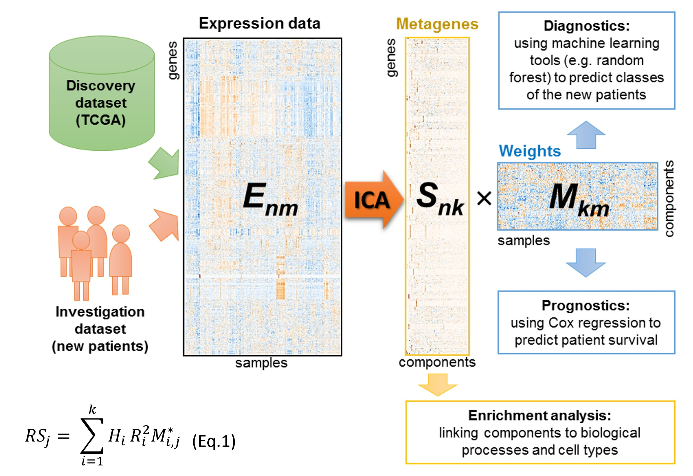

```{r setup, include=FALSE}
knitr::opts_chunk$set(
  collapse = TRUE,
  comment = "#>"
)
```

<font size="2">This document describes the usage of the functions integrated into the package and is meant to be a reference document for the end-user. </font>

# Introduction
Independent component analysis (ICA) of omics data can be used for deconvolution of biological signals and technical biases, correction of batch effects, feature engineering for classification and integration of the data [4]. The consICA package allows building robust consensus ICA-based deconvolution of the data as well as running post-hoc biological interpretation of the results. The implementation of parallel computing in the package ensures efficient analysis using modern multicore systems.

# Installing and loading the package
Load the package with the following command:
```{r, eval = FALSE }
if (!requireNamespace("BiocManager", quietly = TRUE)) { 
    install.packages("BiocManager")
}
BiocManager::install("consICA")
```
```{r, echo=T, results = 'hide'}
library('consICA')
```

# Example dataset
The usage of the package functions for an independent component deconvolution is shown for an example set of 472 samples and 2454 most variable genes from the skin cutaneous melanoma (SKCM) TCGA cohort. It stored as a `SummarizedExperiment` object. In addition the data includes metadata such as age, gender, cancer subtype etc. and survival time-to-event data.
Use data as
```{r}
library(SummarizedExperiment, verbose = FALSE)
data("samples_data")

samples_data
# According to our terminology expression matrix X of 2454 genes and 472 samples
X <- data.frame(assay(samples_data))
dim(X)
# variables described each sample
Var <- data.frame(colData(samples_data))
dim(Var)
colnames(Var)[1:20] # print first 20
# survival time and event for each sample
Sur <- data.frame(colData(samples_data))[,c("time", "event")]
Var <- Var[,-which(colnames(Var) != "time" & colnames(Var) != "event")]

```
# Consensus independent component analysis
Independent component analysis (ICA) is an unsupervised method of signal deconvolution [3]. 
ICA decomposes combined gene expression matrix from multiple samples into meaningful signals in the space of genes (metagenes, S)  and weights in the space of samples (weight matrix, M). 
```{r echo=FALSE, out.width='95%', fig.align="center"}

```
Figure 1. ICA decomposes combined gene expression matrix from multiple samples into meaningful signals in the space of genes (metagenes, S) and weights in the space of samples (weight matrix, M). Biological processes and signatures of cell subtypes can be found in S, while M could be linked to patient groups and patient survival (Cox regression and Eq.1). 

The `consICA` function calculates the consensus ICA for an expression matrix: X = 𝑆 × 𝑀, where S is a
matrix of statistically independent and biologically meaningful signals (metagenes) and M – their weights (metasamples). You can set the number of components, the number of consensus runs. The function will print logs every `show.every` run. Use `ncores` for parallel calculation. To filter out genes (rows) with values lower than a threshold set the `filter.thr` argument.

```{r}
set.seed(2022)
cica <- consICA(samples_data, ncomp=40, ntry=10, show.every=0)
```
The output of consensus ICA is a list with input data `X` (assays of SummarizedExperiment  `samples_data` object) and it dimensions, consensus metagene `S` and weight matrix `M`, number of components, mean R2 between rows of M (`mr2`), stability as mean R2 between consistent columns of S in multiple tries  (`stab`) and number of best iteration (`ibest`). For compact output use `reduced` = TRUE.
```{r}
str(cica, max.level=1)
```

Now we can extract the names of features (rows in `X` and `S` matrices) and their false discovery rates values for positive/negative contribution to each component. Use `getFeatures` to extract them.
```{r}
features <- getFeatures(cica, alpha = 0.05, sort = TRUE)
#Positive and negative affecting features for first components are
head(features$ic.1$pos)
head(features$ic.1$neg)
```
Two lists of top-contributing genes resulted from the `getFeatures` – positively and negatively involved. The plot of genes contribution to the first component (metagene) is shown below.
```{r}
icomp <- 1
plot(sort(cica$S[,icomp]),col = "#0000FF", type="l", ylab=("involvement"),xlab="genes",las=2,cex.axis=0.4, main=paste0("Metagene #", icomp, "\n(involvement of features)"),cex.main=0.6)
```

Estimate the variance explained by the independent components with `estimateVarianceExplained`. Use `plotICVarianceExplained` to plot it.
```{r}
var_ic <- estimateVarianceExplained(cica)
p <- plotICVarianceExplained(cica)
```

# Enrichment analysis
For each component we can carry out an enrichment analysis. The genes with expression above the selected threshold in at least one sample, were used as a background gene list and significantly overrepresented(adj.p-value < `alpha`) GO terms. You can select the db for search: biological process ("BP"), molecular function ("MF") and/or cellular component ("CC").
```{r, results='hide'}
## To save time for this example load result of getGO(cica, alpha = 0.05, db = c("BP", "MF", "CC"))
if(!file.exists("GOs_40_s2022.rds")){
  GOs <- readRDS(url("http://edu.modas.lu/data/consICA/GOs_40_s2022.rds", "r"))
  saveRDS(GOs, "GOs_40_s2022.rds")
} else{
    GOs <- readRDS("GOs_40_s2022.rds")
}
## Search GO (biological process)
# GOs <- getGO(cica, alpha = 0.05, db = "BP")
## Search GO (biological process, molecular function, cellular component)
# GOs <- getGO(cica, alpha = 0.05, db = c("BP", "MF", "CC"))
```

# Survival analysis
Weights of the components (rows of matrix M) can be statistically linked to patient survival using Cox partial hazard regression [4]. In `survivalAnalysis` function adjusted p-values of the log-rank test are used to select significant components. However, the prognostic power of each individual component might not have been high enough to be applied to the patients from the new cohort. Therefore, `survivalAnalysis` integrates weights of several components, calculating the risk score (RS) with improved prognostic power. For each sample, its RS is the sum of the products of significant log-hazard ratios (LHR) of the univariable Cox regression, the component stability R2 and the standardized row of weight matrix M.
```{r}
RS <- survivalAnalysis(cica, surv = Sur)
cat("Hazard score for significant components")
RS$hazard.score
```

# Automatic report generation
The best way to get a full description of extracted components is using our automatic report. We union all analyses of independent components into a single function-generated report.
```{r}
# Generate report with independent components description
if(FALSE){
  saveReport(cica, GO=GOs, Var=Var, surv = Sur)
}
```
The copy of this report you can find at http://edu.modas.lu/data/consICA/report_ICA_40.pdf

```{r}
# delete loaded file after vignette run
unlink("GOs_40_s2022.rds")
```

# Session info 
```{r}
sessionInfo()
```
# References 
1. Golebiewska, A., et al. Patient-derived organoids and orthotopic xenografts of primary and recurrent gliomas represent relevant patient avatars for precision oncology. Acta Neuropathol 2020;140(6):919-949.

2. Scherer, M., et al. Reference-free deconvolution, visualization and interpretation of complex DNA methylation data using DecompPipeline, MeDeCom and FactorViz. Nat Protoc 2020;15(10):3240-3263.

3. Sompairac, N.; Nazarov, P.V.; Czerwinska, U.; Cantini, L.; Biton, A,; Molkenov, A,; Zhumadilov, Z.; Barillot, E.; Radvanyi, F.; Gorban, A.; Kairov, U.; Zinovyev, A. Independent component analysis for unravelling complexity of cancer omics datasets. International Journal of Molecular Sciences 20, 18 (2019). https://doi.org/10.3390/ijms20184414

4.Nazarov, P.V., Wienecke-Baldacchino, A.K., Zinovyev, A. et al. Deconvolution of transcriptomes and miRNomes by independent component analysis provides insights into biological processes and clinical outcomes of melanoma patients. BMC Med Genomics 12, 132 (2019). https://doi.org/10.1186/s12920-019-0578-4
